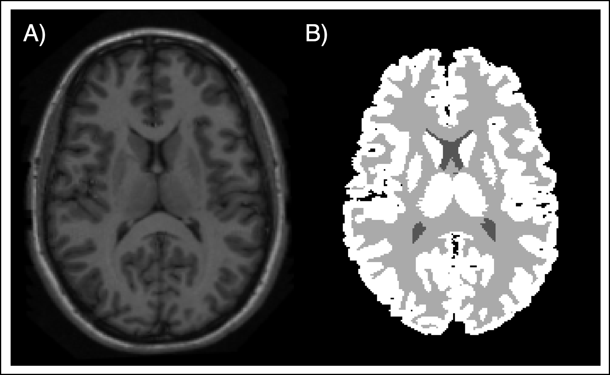
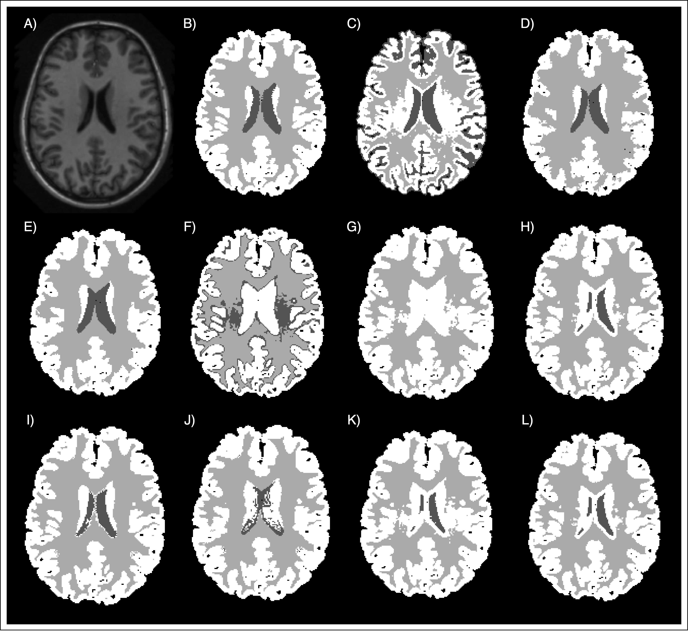

# A Hybrid Approach for Brain Tissue Segmentation: Integrating Gaussian Mixture Models with Atlas-based and Tissue Modeling Techniques

## Dataset
The dataset used for this laboratory contains 20 cases, each with a T1-weighted scan and a ground truth (GT) consisting of segmentation masks for white matter (WM), grey matter (GM), and cerebrospinal fluid (CSF). A registration step was performed prior to the segmentation to register the atlas, i.e., the mean image, to the target. 

  
   
  <em>Fig.1. Example of the different modalities of the dataset. A) T1-weighted C) GT</em>

## Methodology
Our approach involved a hybrid technique integrating Gaussian Mixture Models (GMM) with Atlas-based and Tissue Modeling techniques. The methodology encompassed various stages:
1. **Atlas Registration**: Employing a multi-step registration process using rigid, affine, and multi-resolution b-spline registration.
2. **Segmentation Techniques**: We experimented with segmentation using tissue models, probabilistic atlas, and combinations of both, with and without GMM. We also explored different GMM initialization methods and integration of the probabilistic atlas at various stages of the process.

## Results
The effectiveness of the methods was evaluated using the Dice Score and Balanced Accuracy metrics. We found that the combination of tissue models and probabilistic atlas yielded the best results. Below are detailed tables of our findings:

### Results of Different Segmentation Approaches without Using GMM Algorithm
| Initialization           | CSF (Dice: mean ± std) | WM (Dice: mean ± std) | GM (Dice: mean ± std) | BA (mean ± std) | Time [s] (mean ± std) |
|--------------------------|-----------------------|----------------------|----------------------|----------------|----------------------|
| Tissue Models            | 0.247 ± 0.164         | 0.780 ± 0.087        | 0.816 ± 0.111        | 0.614 ± 0.100  | **0.644 ± 0.101**    |
| Probabilistic Atlas      | 0.790 ± 0.055         | 0.846 ± 0.015        | 0.771 ± 0.019        | 0.802 ± 0.025  | 1.478 ± 0.531        |
| Combination of Both      | **0.856 ± 0.050**     | **0.915 ± 0.012**     | **0.867 ± 0.018**     | **0.879 ± 0.021** | 108.320 ± 19.230   |

### Results of Different Initialization Types
| Initialization           | CSF (Dice: mean ± std) | WM (Dice: mean ± std) | GM (Dice: mean ± std) | BA (mean ± std) | Time [s] (mean ± std) |
|--------------------------|-----------------------|----------------------|----------------------|----------------|----------------------|
| K-means                  | 0.196 ± 0.289         | **0.879 ± 0.089**    | 0.792 ± 0.053        | 0.703 ± 0.106  | 40.163 ± 21.664      |
| Tissue Model             | 0.300 ± 0.313         | 0.854 ± 0.096        | 0.839 ± 0.049        | **0.746 ± 0.087**  | **18.277 ± 14.510** |
| Probabilistic Atlas      | **0.307 ± 0.319**     | 0.831 ± 0.108        | **0.840 ± 0.044**    | 0.737 ± 0.082  | 21.220 ± 11.963      |

### Results of Different Initializations and Atlas Integration Points
| Initialization                           | Atlas Integration | CSF (Dice: mean ± std) | WM (Dice: mean ± std) | GM (Dice: mean ± std) | BA (mean ± std) | Time [s] (mean ± std) |
|------------------------------------------|-------------------|-----------------------|----------------------|----------------------|----------------|----------------------|
| Best initialization*                     | After             | **0.729 ± 0.092**     | 0.935 ± 0.013        | 0.883 ± 0.026        | **0.870 ± 0.047** | 16.5 ± 14.2          |
|                                          | Into              | 0.623 ± 0.139         | **0.948 ± 0.010**    | **0.920 ± 0.014**    | 0.830 ± 0.044  | 29.9 ± 23.0          |
| Tissue Model & Probabilistic Atlas       | After             | 0.354 ± 0.282         | 0.850 ± 0.108        | 0.848 ± 0.049        | 0.756 ± 0.068  | 21.4 ± 18.1          |
|                                          | Into              | 0.337 ± 0.252         | 0.876 ± 0.066        | 0.661 ± 0.332        | 0.625 ± 0.123  | **11.5 ± 6.0**       |
| MNI Atlas & Best Initialization*         | Into              | 0.374 ± 0.152         | 0.884 ± 0.017        | 0.792 ± 0.040        | 0.756 ± 0.068  | 29.9 ± 23.0          |

_*Best initialization refers to the "Tissue Model" method in this context._

In addition, some qualitative results are presented. In Figure 2 we can observe an example of the different segmentations techniques presented in this project. Additionally, the Figure 3 represents a visual comparison of the segmentation obtained by the best approach using our atlas, and the segmentation obtained using the MNI atlas.

  
   
  <em>Fig. 2: Example of the different results obtained in this project. A) Original Image B) GT C) Tissue Models Segmentation D)
Probabilistic Atlas Segmentation E) Combination of C and D F) KMeans Initialization for GMM G) Tissue Models Initialization for
GMM H) Probabilistic Atlas Initialization for GMM I) Best Approach (Tissue Models) including Probabilistic Atlas Into GMM algorithm
J) Best Approach (Tissue Models) including Probabilistic Atlas After EM algorithm K) Tissue Model & Propabalistic Atlas Initialization
For GMM including Probabilistic Atlas After GMM algorithm L) Tissue Model & Propabalistic Atlas Initialization for GMM including
Probabilistic Atlas Into GMM algorithm</em>

  
   
  <em>Fig. 3: Example of the segmentation by employing the MNI atlas. A) Original Image, B) Ground Truth, C) Best segmentation by
employing our atlas, D) MNI segmentation</em>

## Conclusion
In this study, we explored various brain tissue segmentation techniques, focusing on the integration of probabilistic atlases and tissue models. Our experiments revealed that combining these two methods significantly enhances the accuracy of segmentation, as evidenced by the improved dice scores. The standout finding was the superior performance of the tissue model, both as a standalone approach and when used in conjunction with the probabilistic atlas.

Further, we observed that the timing of atlas integration plays a crucial role in the segmentation process. The integration of the probabilistic atlas post-GMM computation emerged as the most effective strategy, suggesting a nuanced interplay between atlas information and GMM initialization. These insights pave the way for more sophisticated approaches in medical imaging analysis.

Moving forward, we aim to incorporate these findings into a deep learning framework. We believe that leveraging the strengths of both traditional and modern techniques will revolutionize the accuracy and efficiency of brain tissue segmentation. The potential for improved diagnostic tools and treatment strategies in neurology is immense, and our study marks a significant step toward realizing this goal.
